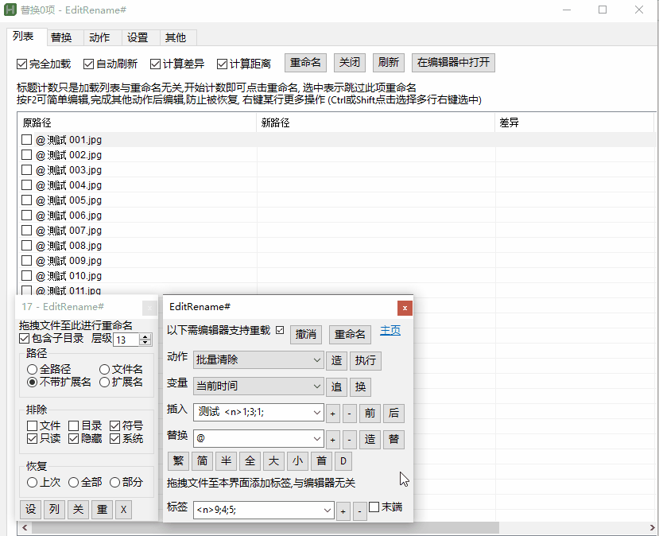
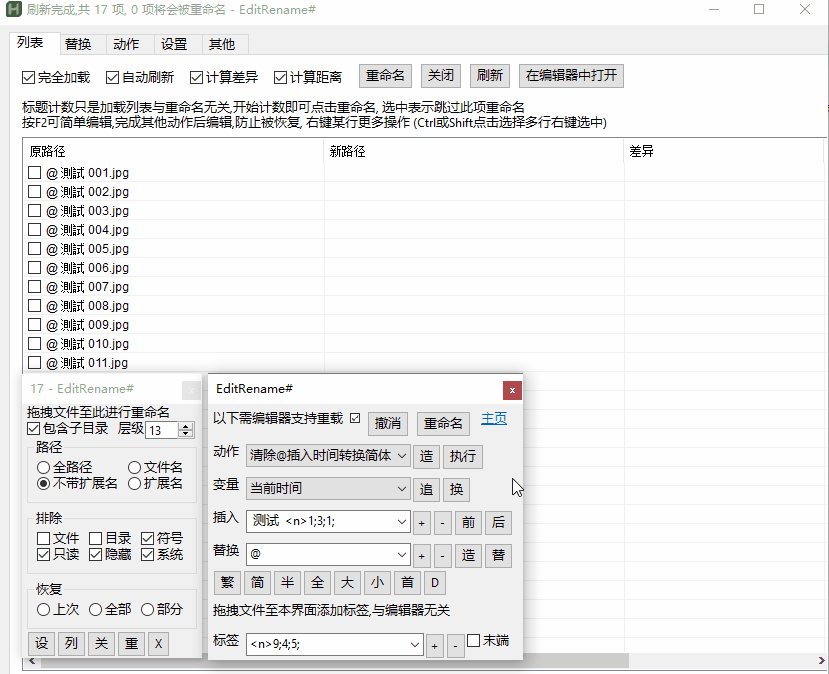

### EditRename
-  用熟悉的文本编辑器,所见即所得的重命名

### 使用
- 运行`EditRename.exe`, 选择编辑器
    - 编辑器需能在标题显示文件名
- 不要调整行顺序,不要删除行,尽量在一项操作完成再进行后继续操作
- 传入参数
    - 拖拽文件至主界面上
    - 拖拽文件至列表界面上 (清除当前列表重新添加)
    - 将文件路径作为参数传入
    - 将文件路径复制到剪贴板,然后将 `clip` 作为唯一参数传入
    - 将文件路径保存至 `%temp%` 目录下的指定文件(`UTF-8`编码),将此文件作为唯一参数传入
    - 将文件拖到程序图标上`有数量限制`
- 开始重命名
    - 编辑器模式 关闭编辑器时会自动重命名
        - 多标签编辑器并设置时切换标签立即进行重命名
    - 主界面 `重`, `X`及`列`界面 `重命名` 开始重命名
- 退而重命名
    - 直接关闭界面或右键托盘图标退出 直接退出程序
    - 主界面`关`, `列`界面`关闭` 退出重命名而不退出程序
- `设` 设置界面
- `列` 文件列表界面
- `X`  副界面 一些简单的编辑
- `造` 生成规则界面
- `其他` 一些非通用的操作

### 特色功能
- `表达式` 为操作添加前置条件
    - 很多时候仅想操作部分文件,筛选文件过于复杂可用此作为前置条件
    - `表达式` 工作于`替换`及`动作`
    - `表达式`是按顺序计算
    - 非复杂`表达式`可快速返回结果(逻辑短路)
    - 部分`条件`可能会耗时较久,基本越往下越耗时,酌情使用
    - 可通过`设置` `属性` 添加更多 `条件`
- `动作` 批量执行多项操作
    - 很多时候需要重复执行一些操作,此功能将这些操作保存,方便一键调用
    
### 截图
- 使用流程
    - 

- 完整界面
    - 

- 动作
    - 

### 下载链接 :
[百度云](https://pan.baidu.com/s/1NY4ov9B7eLPH1ogTn7OoVg?pwd=su4z)

[Github]( https://github.com/vvyoko/EditRename/releases/latest)
