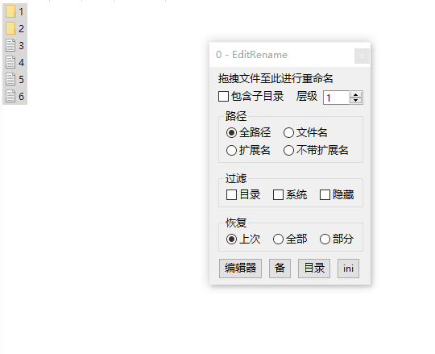
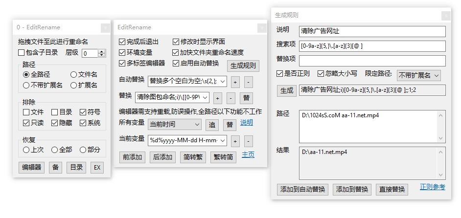

### EditRename
-  用熟悉的文本编辑器,所见即所得的重命名

### 使用
- 运行`EditRename.exe`, 选择编辑器
    - 编辑器需能在标题显示文件名
- 不要调整行顺序,不要删除行,尽量在一项操作完成再进行后继续操作
- 传入参数
    - 拖拽文件至界面上
    - 将文件路径作为参数传入
    - 将文件路径复制到剪贴板,然后将 `clip` 作为唯一参数传入
    - 将文件路径保存至 `%temp%` 目录下的指定文件(`UTF-8`编码),将此文件作为唯一参数传入
    - 将文件拖到程序图标上`有数量限制`
- 关闭编辑器时会自动重命名
    - 多标签编辑器并设置时切换标签立即进行重命名
- 修改错误时右键托盘图标退出或直接关闭界面
- `EX` 副界面 (再次点击关闭)
    - 一些基本设置及简单编辑
    - 简单编辑 依赖于编辑器自动重载
        - 保存常用替换规则
        - 变量简单插入
        - 简繁转换

### 截图
- 使用流程
    - 

- 完整界面
    - 

### 下载链接 :
[百度云](https://pan.baidu.com/s/1NY4ov9B7eLPH1ogTn7OoVg?pwd=su4z)

[Github]( https://github.com/vvyoko/EditRename/releases/latest)
